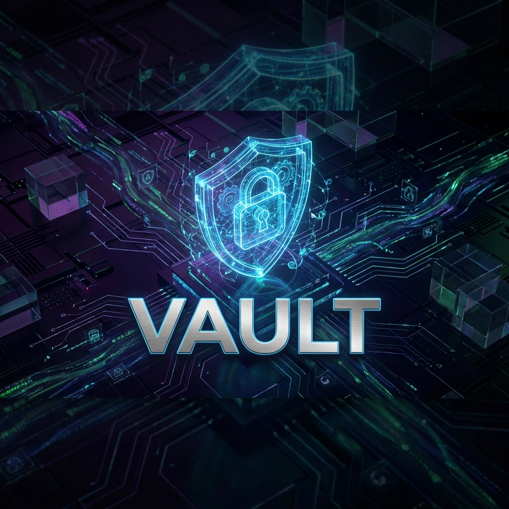

# Vault - Secure Local Media Storage



[](https://shadow-vault-mu.vercel.app/)

**Vault** is a privacy-focused, offline-first web application designed to securely store your sensitive images and videos directly in your browser. Unlike cloud storage solutions, Vault keeps your data 100% local on your device using IndexedDB, ensuring that your files never leave your control.


> **⚠️ IMPORTANT:** This application uses your browser's local storage. **Clearing your browser cache or site data will PERMANENTLY DELETE all files stored in the Vault.** Always export important data before clearing your history.

## ✨ Key Features

*   **🔒 Secure Access**: Protected by a user-defined 4-digit PIN (verified securely via a Node.js backend).
*   **🛡️ Client-Side Privacy**: Media files are stored strictly locally within the browser's IndexedDB. No media data is ever uploaded to a server.
*   **📂 Organized Storage**: Create folders and organize your media with a familiar file explorer interface.
*   **⚡ PWA Ready**: Installable as a native-like app on desktop and mobile devices. Fully functional offline.
*   **📦 Bulk Management**: Select multiple files/folders to delete or export as a ZIP archive.
*   **👁️ Built-in Preview**: View images and watch videos directly within the secure viewer without exporting them first.
*   **💾 Persistent Storage**: Automatically requests persistent storage permission to prevent the browser from casually verifying your data.

## 🚀 Quick Start

### Prerequisites
*   A modern web browser (Chrome, Edge, Firefox, Safari).
*   Reasonable available disk space on your device.

### Running Locally

1.  **Clone the repository:**
    ```bash
    git clone https://github.com/yourusername/vault-web.git
    cd vault-web
    ```

2.  **Install dependencies and start the backend server:**
    ```bash
    npm install
    npm start
    ```

3.  **Open in Browser:**
    Navigate to `http://localhost:3000` to access the application.

4.  **Setup:**
    *   The first time you load the app, you will be prompted to create a **4-digit PIN**.
    *   **Remember this PIN!** There is no "Forgot PIN" recovery mechanism. If you lose the PIN, you lose access to the files.

## 🛠️ Technology Stack

*   **Frontend:** HTML5, CSS3, Vanilla JavaScript (ES6+)
*   **Backend:** Node.js, Express.js
*   **Storage:** IndexedDB (via a custom wrapper)
*   **Crypto:** Web Crypto API & Node.js Crypto (SHA-256 for PIN hashing)
*   **PWA:** Service Workers, Web Manifest
*   **Utilities:** JSZip (for export)


---
*Built with ❤️ for Privacy.*
